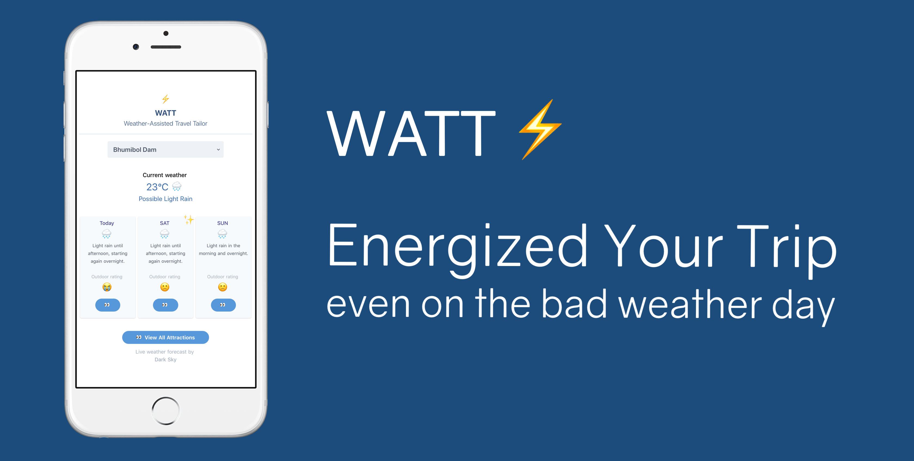

# Hackathon-EGAT

> Startup Hackathon 2019 hosted by EGAT

## WATT ⚡️

**Weather-Assisted Travel Tailor**  
Weather 🌦 x Travel 🧳 x EGAT ⚡️



We combine weather forecast with travel attractions to make tourists happy regardless of weather conditions.
Tourists no longer need to spend their whole days getting stuck in hotels while it rains outside. Why not suggest them to explore indoor activities, especially those provided by the local.

### Tools used

Vue, Nuxt, Tailwind, Dark Sky, Zeit Now, Netlify

## Build Setup

```bash
# install dependencies
$ yarn install

# serve with hot reload at localhost:3000
$ yarn dev

# build for production and launch server
$ yarn build
$ yarn start

# generate static project
$ yarn generate
```

For detailed explanation on how things work, checkout [Nuxt.js docs](https://nuxtjs.org).
